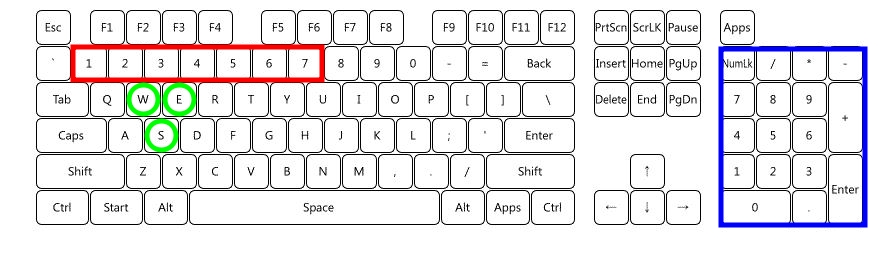

# ATP Designer Guide
ATP (All-That-Performance) 디자이너 사용 방안에 관한 문서입니다.

### 1. 단축키

- 1~7 *(빨간박스)*  
빨강, 초록, 파랑, 노랑, 청녹, 자홍, 흰색

- 0~9 *(파란박스)*  
20%, 38%, 51%, 61%, 68%, 76%, 83%, 88%, 94%, 100%

- w  
작성 모드 단축키

- e  
지우개 모드 단축키

- s  
선택 모드 단축키

- 방향키 좌우  
디자이너 시간 변경

### 2. 편집 모드
- 작성 모드 (Write Mode)  
키보드의 숫자 버튼을 이용해 색상을 선택(빨간 박스), 오른쪽 키패드(파란 박스)를 이용해 밝기 선택후 마우스 클릭으로 그리기.  
오른쪽 키패드가 없을 경우 +,- 키보드를 이용해 밝기 변경 가능.

- 지우개 모드 (Erase Mode)  
지우개 표시가 되며, 지우고 싶은 셀위를 드래그.

- 선택 모드 (Select Mode)  
마우스 드래그로 선택이 되며, 선택된 셀이 반짝임.  
반짝이는 셀을 선택하고 드래그 하면 셀 이동이 가능.  
반짝이는 셀을 Ctrl 키를 누른채 드래그 하면 복사됨.  
반짝이는 셀을 오른쪽 마우스로 클릭시, 현재 선택한 색상과 밝기로 변경됨.

### 3. 주의사항
- 디자이너의 수정 작업 내용은 **프로젝트**라고 칭하며, 불러오기/내보내기가 가능합니다. *(json 파일 형식)*
- 작업 내용을 ATP노드에 반영하기위해선 **익스포트**를 해야 하며, **익스포트**시 **.atp**형식의 파일이 자동 다운로드 됩니다.
- **.atp**형식의 파일 이름 변경은 자유로우나 반드시 **영문 대소문자, 숫자**로 **8글자** 이내로 하셔야 합니다. *(ex: blink.atp, perform.atp)*

### 4. 버전 히스토리
- v1.0 *(2021/04/12)*